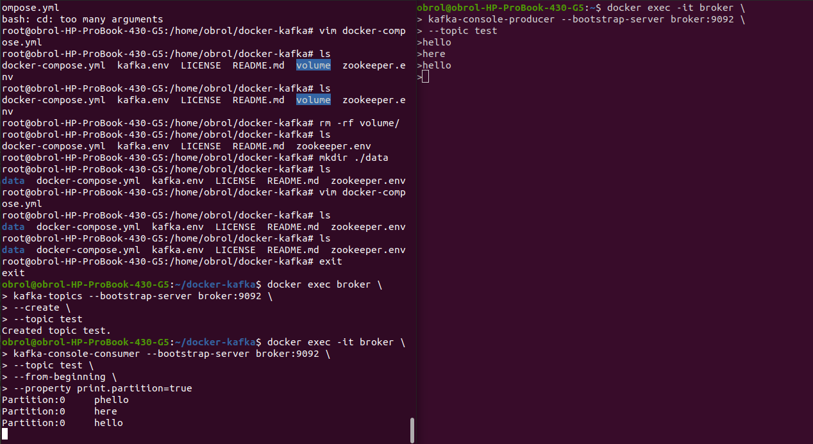
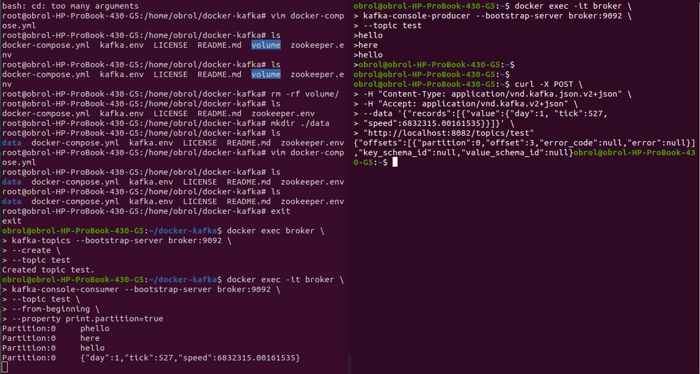
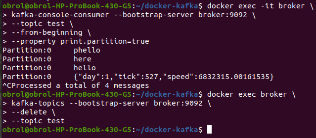
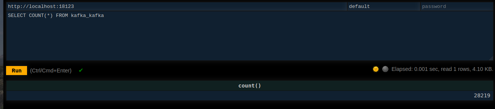
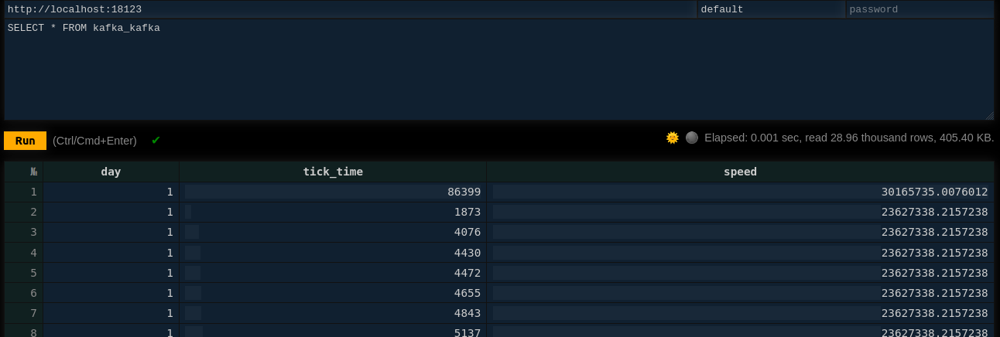

# kafka + mqtt

# For some help

CREATE TABLE IF NOT EXISTS kafka_table (
    day UInt16,
    tick_time UInt32,
    speed Decimal64(8)
)
ENGINE = Kafka()
SETTINGS
    kafka_broker_list = 'kafka:9092',
    kafka_topic_list = 'test',
    kafka_group_name = 'kafka_group',
    kafka_format = 'CSV'

CREATE MATERIALIZED VIEW kafka_table_view
ENGINE = Memory
AS
SELECT * FROM kafka_table
SETTINGS
stream_like_engine_allow_direct_select = 1;